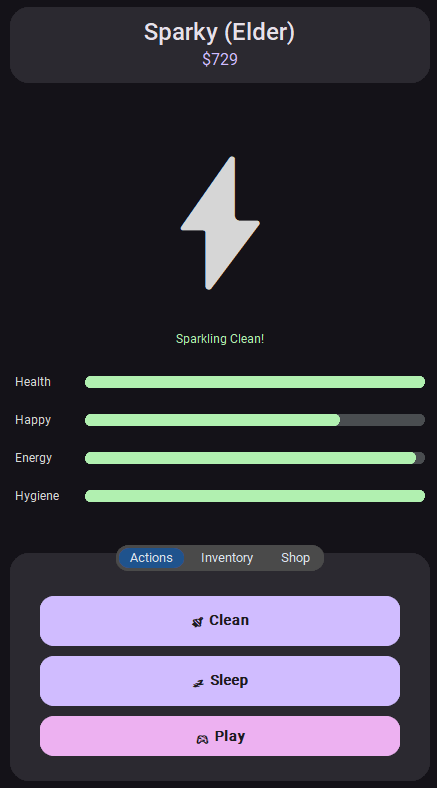
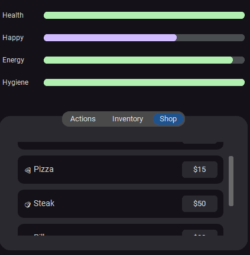
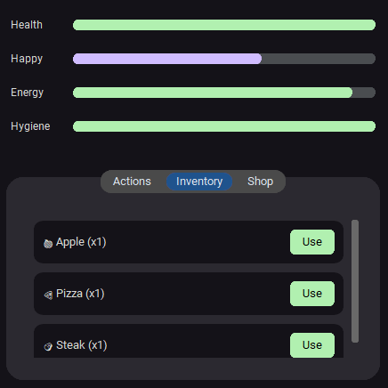

# 🐾 Virtual Pet Simulator

**A sleek desktop companion built with Python & CustomTkinter.**

---

## ✨ Features

* **Modern UI:** Material Design with Dark Mode support.
* **Evolution:** Grow your pet from **Egg** to **Elder**.
* **Species:** Choose between a **Dog**, **Cat**, or **Pikachu**.
* **Economy:** Earn currency through minigames to spend in the Shop.
* **Real-time Stats:** Manage Health, Happiness, Energy, and Hygiene.

---

## 🚀 Getting Started

1. **Install Dependency:**
```bash
pip install customtkinter

```


2. **Run Game:**
```bash
python material_pet_pro.py

```

<div align="center">
  
</div>
<div align="center">
  
</div>

<div align="center">
  
</div>

---

## 🎮 How to Play

| Action | Effect | Cost |
| --- | --- | --- |
| **💊 Medicate** | Restores Health | Money |
| **🍔 Feed** | Decreases Hunger | Money |
| **⚽ Play** | Earns Cash | Energy |
| **🚿 Clean** | Increases Hygiene | Free |
| **💤 Sleep** | Restores Energy | Time |

> [!WARNING]
> Low **Hygiene** makes your pet sick, doubling the rate of Health decay!

---

## 📂 Project Structure

* `ss/`: Images.
* `vps.py`: Main game script.

---

<div align="center">Made with ❤️ using Python</div>

---
